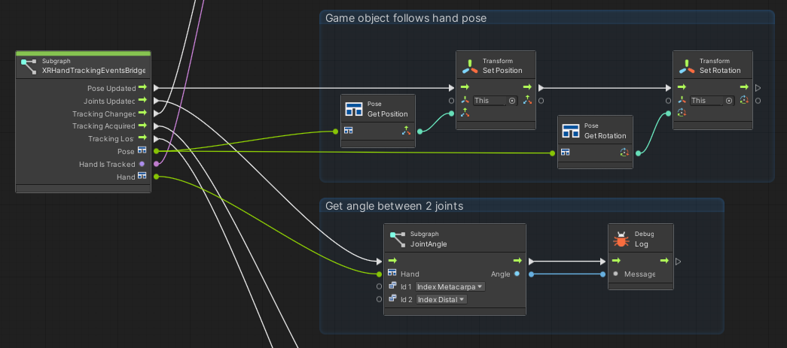

# VS XR hand tracking

Access XR Hand tracking events using Visual scripting in Unity.

[https://github.com/prossel/VS-XR-hand-tracking](https://github.com/prossel/VS-XR-hand-tracking)

## Requirements

This package is based on these packages. Install them first.

* OpenXR Plugin
* XR Hands

## Installation

* First install other packages listed in requirements section
* Unity, menu Window > Package Manager
* Click the [ + ] button at top left
* Add Package from git URL: `https://github.com/prossel/VS-XR-hand-tracking`
* To update the package later, use the [ Update ] button

## Getting started

### XR Hand Tracking Events

* Create an empty GameObject
* Add a Script Machine component
* Use an embedded graph or create a new one
* Edit your graph
* Right click to add a node: XRHandTrackingEventsBridge
* Connect the trigger outputs to your logic

## History

See [CHANGELOG.md](CHANGELOG.md)
